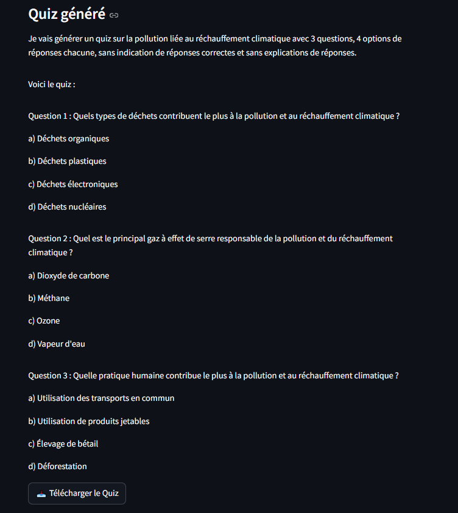

# Générateur de Quiz Contextuels avec RAG : Reformatage du quiz basées sur les Documents

## Objectif du Projet

Ce projet vise à construire un modèle de Langage Large (LLM) basé sur la méthode RAG (Génération Augmentée de Récupération) pour améliorer les résultats de l'IA générative dans la création de quiz. L'objectif est de permettre à l'utilisateur de spécifier des informations précises pour générer un contexte de quiz adapté.

Au total on peut choisir 8 sujets différents pour le quiz:
- Aide Humanitaire 
- Alimentation et Nutrition 
- Crise Humanitaire
- Droit Civil
- Droit Fondamental
- Droit international
- Intelligence Artificielle
- Réchauffement climatique

## Structure du projet
```
Projet_Streamlit
├── README.md
├── requirements.txt
├── load_documents
        ├── aide_humanitaire.json
        ├── alimentation_et_nutrition.json
        ├── crise_humanitaire.json
        ├── droit_civil.json
        ├── droit_fondamental.json
        ├── droit_international.json
        ├── intelligence_artificielle.json
        └── réchauffement_climatique.json
├── chroma_db
    └── chroma.sqlite3
├── app.py
├── rag.py
└── images_readme
        ├── Part_1_dashboard.png
        └── Part_2_dashboard.PNG
```
## Premier aperçu du générateur du quiz


## Fonctionnalités

L'utilisateur doit fournir les informations suivantes pour générer le quiz :

1. **Nom du sujet** : Choisir sur la liste sur Streamlit :

2. **Option des réponses** : Définir si les questions auront des choix uniques ou multiples.

3. **Nombre de tokens** : Spécifier le nombre de tokens pour générer le quiz.

4. **Nombre de documents** : Spécifier le nombre de documents  pour récupérer les documents les plus pertinents

## Structure du Quiz en Sortie

Le quiz généré aura la structure suivante :

- **Nom du sujet** : Trouvé dans les documents.
- **Nouvelle question** : Générée en fonction du contexte.
- **Nouvelle liste des options** : Liste des choix possibles pour la question.
- **Une ou plusieurs nouvelles réponses correctes** : Indiquer la ou les réponses exactes.
- **Nouvelle explication** : Fournir une explication pour comprendre la ou les réponses exactes.

## Utilisation

Pour utiliser ce script, suivez les étapes suivantes :

1. **Creation et activation de l'environnement virtuel** :     
   ```bash
   py -m venv env
   ```

   ```bash
   source env/Scripts/activate
   ```

2. **Installer les dépendances nécessaires** : 
   ```bash
   pip install -r requirements.txt
   ```

3. **Exécuter le script** :
   ```bash
   streamlit run app.py --logger.level=error
   ```

4. **Fournir les informations requises** :
    - Le nombre spécifique de questions
    - Le nombre d'options de réponses spécifiques
    - Avec ou sans indication des réponses correctes
    - Avec ou sans explication pour chaque réponse
    - Indiquer un ou plusieurs réponses correctes

## Exemple de sortie du quiz qu'on obtient sur Streamlit 

On peut prendre par exemple de demander de générer 3 questions sans indication les réponses correctes et sans explications



## Contribution

Les contributions sont les bienvenues ! Veuillez ouvrir une issue ou soumettre une pull request pour toute amélioration ou correction.

## Licence

Ce projet est sous licence MIT. Voir le fichier `LICENSE` pour plus de détails.

---

Ce README fournit une vue d'ensemble du projet et des instructions pour son utilisation. Pour plus de détails, référez-vous aux commentaires dans le code source.
